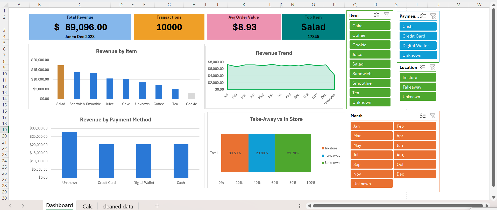

# Cafe Sales Dashboard (Excel)

An interactive Excel dashboard analysing a year of cafe sales (Jan–Dec 2023).

## Key Metrics
- **Total revenue:** $89,096
- **Transactions:** 10,000
- **Average order value:** $8.93
- **Top item:** Salad

## What's in the workbook
- **Dashboard**: KPI cards, charts and slicers (Item, Payment Method, Location, Month)
- **Calc**: pivot tables and calculations feeding the dashboard
- **cleaned data**: the dataset after cleaning (10,000 rows)

## Visuals
- Revenue by item
- Monthly revenue trend
- Revenue by payment method
- Take-away vs in-store share

## Data Cleaning
Missing values in Item, Payment Method, Location and Month were labelled "Unknown" rather than dropped, so totals stay complete.

## Key Insights
- Salad is the top revenue item, ahead of Sandwich and Smoothie.
- Monthly revenue stays fairly steady through the year.
- Revenue is spread almost evenly across payment methods.
- Take-away (29.8%) and in-store (30.5%) are close, with 39.7% of orders missing a location.

## Tools
Excel: PivotTables, PivotCharts, slicers, data cleaning
